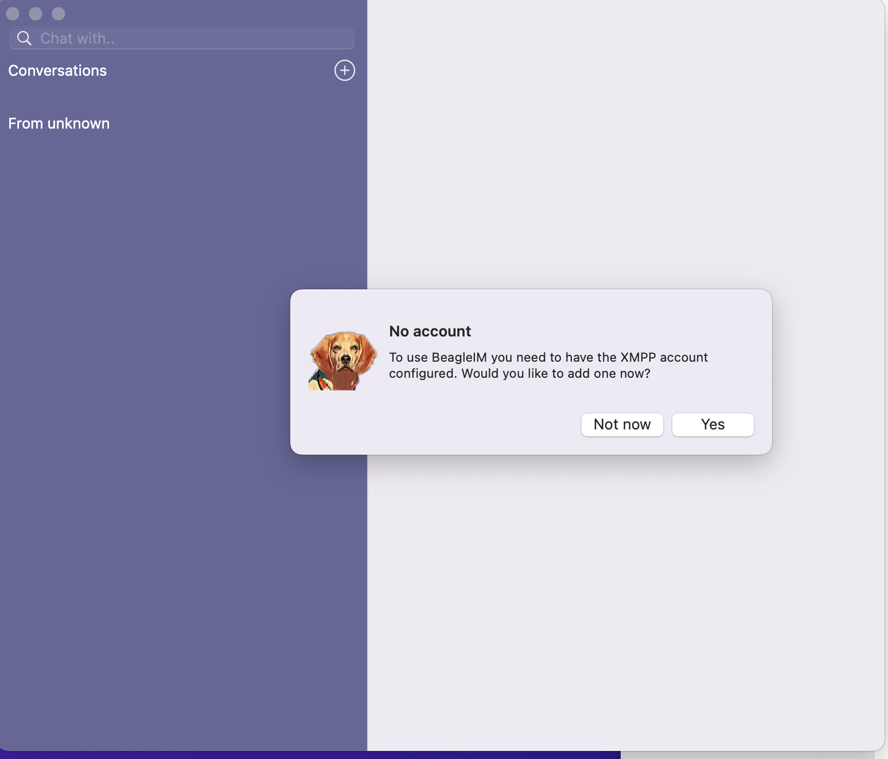
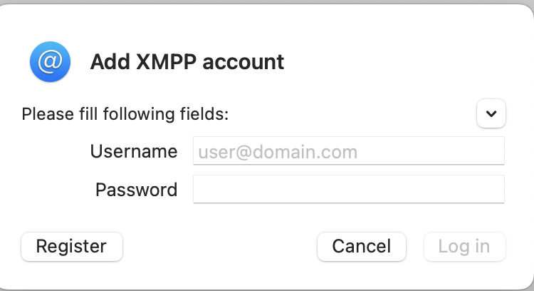
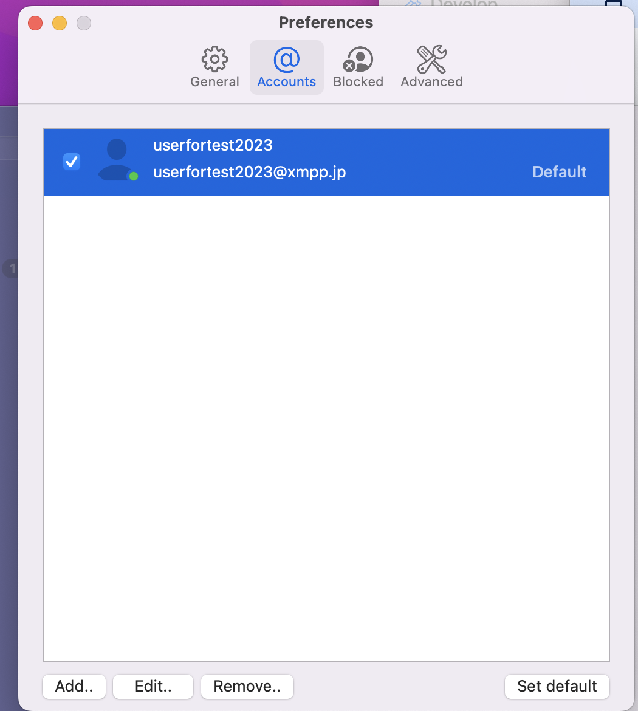

Welcome
========

Welcome to the documentation for BeagleIM for macOS.

BeagleIM is a lightweight and powerful XMPP client developed by Tigase, Inc. It provides an easy way to start using the XMPP Protocol (formerly known as Jabber) if you've never used it before. Veterans of the protocol will find many features here they are familiar.

- Control multiple accounts from a single application and sign into all your XMPP accounts at once.

- Message Archive supported: Access chat history from the server.

- Support for joining and creating chatrooms for multi-party collaboration.

- Automated status management; no need to change status every time you put your computer to sleep or leave it for a while.

- In-band registration; Sign into and create a new account on your favorite XMPP/Jabber​ server!

- Photos and other files easy sharing in private chats and in group chats, even with people using different XMPP clients.

- Vcard support: robust user profiles.

Minimum Requirements
--------------------------

Requires macOS 11.0 or later and a Mac with Apple M1 chip or later.

Installation
-------------

BeagleIM is a good choice if you want to use an XMPP account on your iMac. You can get BeagleIM from the App Store (`external <https://apps.apple.com/us/app/beagle-im/id1445349494?mt=12>`__ ). Please keep in mind that BeagleIM is available in English only.

Account Setup
----------------------------

After downloading BeagleIM from the App Store you can start it by clicking the BeagleIM icon. The below window will be popped up:

|images/register01|

Your options now are to add the XMPP account now or later. If you click "Yes", you will need the XMPP account to log in if you already have one. Otherwise, you will need register a new XMPP account

Registering for a New XMPP Account
^^^^^^^^^^^^^^^^^^^^^^^^^^^^^^^^^^^

You have the choice between a lot of different XMPP providers. Your XMPP address will be the username you choose followed by the @-sign and the domain of the chosen provider.

Some examples for XMPP providers are:

magicbroccoli.de: Registration (`external <https://magicbroccoli.de/register/>`__ ). 
wiuwiu.de: Registration (`external link <https://wiuwiu.de/>`__ ). 
You can also choose a provider by looking at this list: (`external <https://apps.apple.com/us/app/Beagle-im/id1153516838>`__ ). 

If you do not know any XMPP server domain names, then you could select one of trusted servers from `here <https://list.jabber.at/>`__

Use an Existing Account
^^^^^^^^^^^^^^^^^^^^^^^^

Now you select Sign in to an existing XMPP account since you already registered an address in the previous section. Afterwards, you have to enter your XMPP address, your password and finish these steps by clicking "Log in". Please keep in mind that in this tutorial the XMPP address userfortest2023@xmpp.jp is used as an example account.

|images/register02|

Your XMPP address is now configured to be used in BeagleIM. 

Final Steps
------------

Once your account is verified, the application will log you in as online and display the "Preferences" as follows:

|images/register03|

If you do not want to make any change at this moment, you could close this wendow and now you go to the chat main screen.

